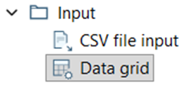
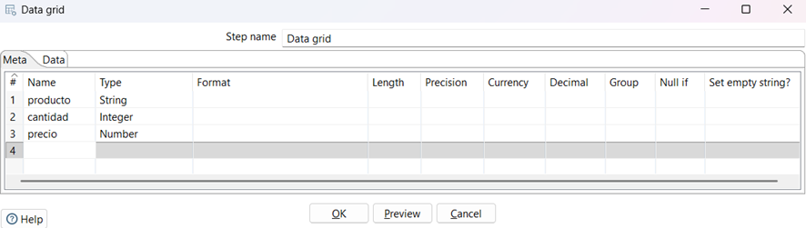
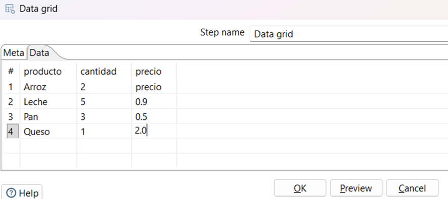
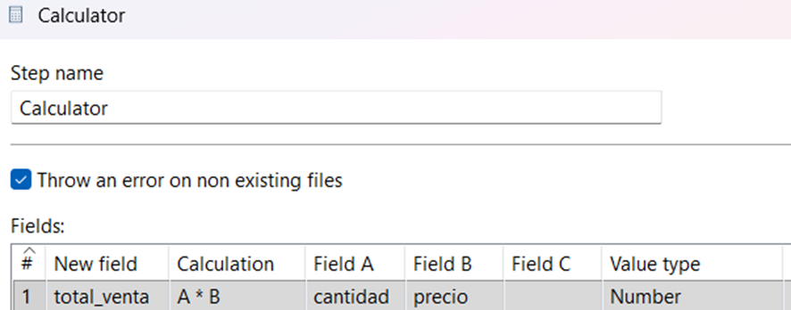
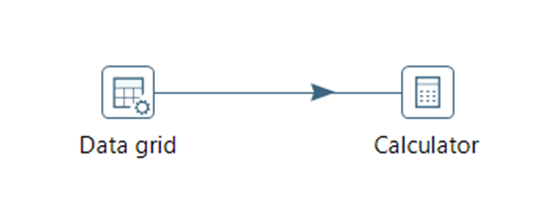
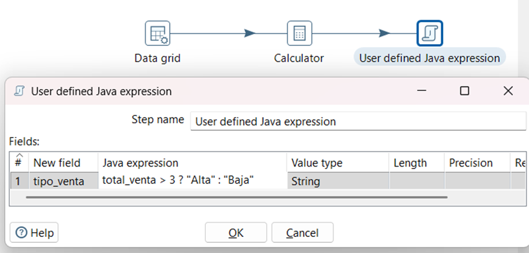
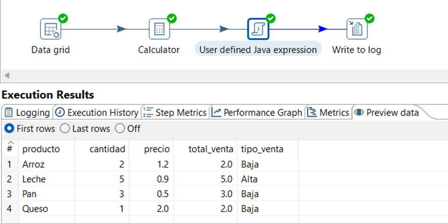

# Práctica Pentaho: Data Grid + Calculator

##  Descripción
Esta práctica tiene como objetivo aprender a crear y transformar datos dentro de Pentaho. Por lo que para este ejercicio utilizaremos los componentes **Data Grid** y **Calculator** como eje central.

**Data Grid** permite crear datos manuales dentro de la transformación, como si fuese una tabla pequeña creada a mano, sin necesidad de archivos o bases de datos.

**Calculator** es un componente que sirve para realizar cálculos matemáticos sobres los datos.

Para ejemplicar estos componentes se simulara un conjunto de ventas y se calculara el total por cada registro.

## Flujo de la transformación

## Paso 1: Crear transformación

1. Abrir Pentaho Spoon  
2. Ir a: File -> New -> Transformation
3. Buscar: `Data Grid`
4. Arrastrar al lienzo

### Paso 2: Definir estructura (Meta)

Agregar los siguientes campos:
| Campo    | Tipo   |
|----------|--------|
| producto | String |
| cantidad | Integer|
| precio   | Number |

### 2.1 Ingresar datos (Data)

Como estamos llevando un ejemplo de una tienda, ingresamos nombres y precios de alimentos en nuestra tabla.

## Paso 3: Configurar Calculator

Arrastramos el componente `Calculator` hacia nuestro lienzo y realizamos las siguientes configuraciones:

## Paso 4: Conectar componentes

Conectamos todos los componentes

### 4.1 Resultado esperado

Se crea una nueva columna que almacenara el total_Venta, este llevara una logica interna por lo cual fue necesario usar otro componente llamado `User defined Java Expression`:

## Paso 5: Visualizar resultados

### Opción recomendada:

Agregar componente:

- `Write to log`

## Paso 6: Ejecutar

1. Click en (Run)
2. Revisar salida en consola

