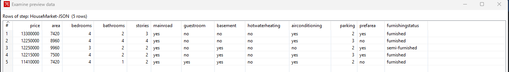
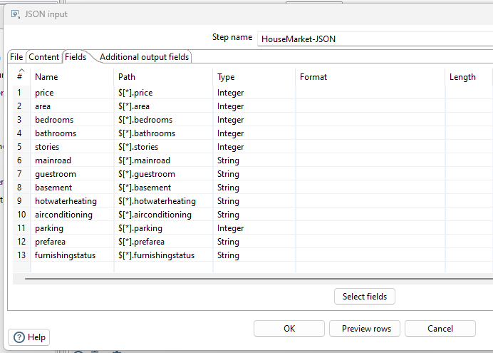
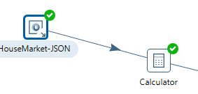
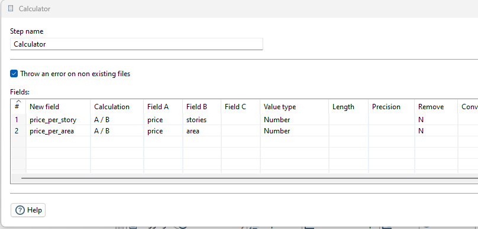
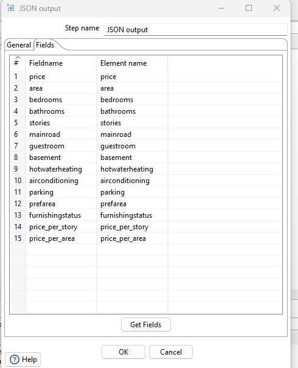
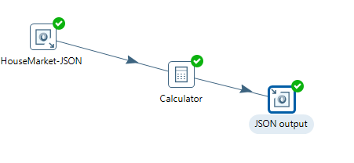

# Flujo de Transformación en Pentaho (JSON → Cálculo → JSON)

**Autor:** Daniel Jaramillo

---

## Descripción General

Este documento describe un flujo básico en Pentaho Data Integration (PDI) para procesar datos del mercado inmobiliario actual utilizando una fuente JSON, aplicar transformaciones y generar un output en formato JSON.

---

## Componentes del Flujo

* **Input:** JSON Input (`jsonInput`)
* **Transformación:** Calculator (`calculator`)
* **Output:** JSON Output (`jsonOutput`)

---

## Paso 1: Cargar Datos

Se utiliza el componente **JSON Input** para cargar los datos desde la siguiente fuente:

Fuente de datos:
https://www.agentsfordata.com/json/sample

### Configuración:

* Tipo: JSON Input
* Archivo descargado localmente
* Loop XPath: `$[*]`
* Campos a extraer:



---

## Paso 2: Seleccionar Campos

Seleccionar los campos relevantes para el análisis del mercado inmobiliario:



---

## Paso 3: Conectar Input con Transformación

Se conecta el componente **jsonInput** con la transformación **calculator** para procesar los datos.



---

## Paso 4: Cálculos

Dentro del componente **Calculator**, se realizan los siguientes cálculos:

* **Precio por piso:**

  ```
  price / stories
  ```

* **Precio por pie cuadrado:**

  ```
  price / area
  ```

### Campos generados:

* price_per_story
* price_per_area



---

## Paso 5: Output JSON

Se utiliza el componente **JSON Output** para exportar los datos transformados.

### Configuración:

* Incluir todos los campos originales
* Incluir campos calculados:

  * price_per_story
  * price_per_sqft


---

## Flujo Completo

```
jsonInput → calculator → jsonOutput (json_calculator.js)
```



---

